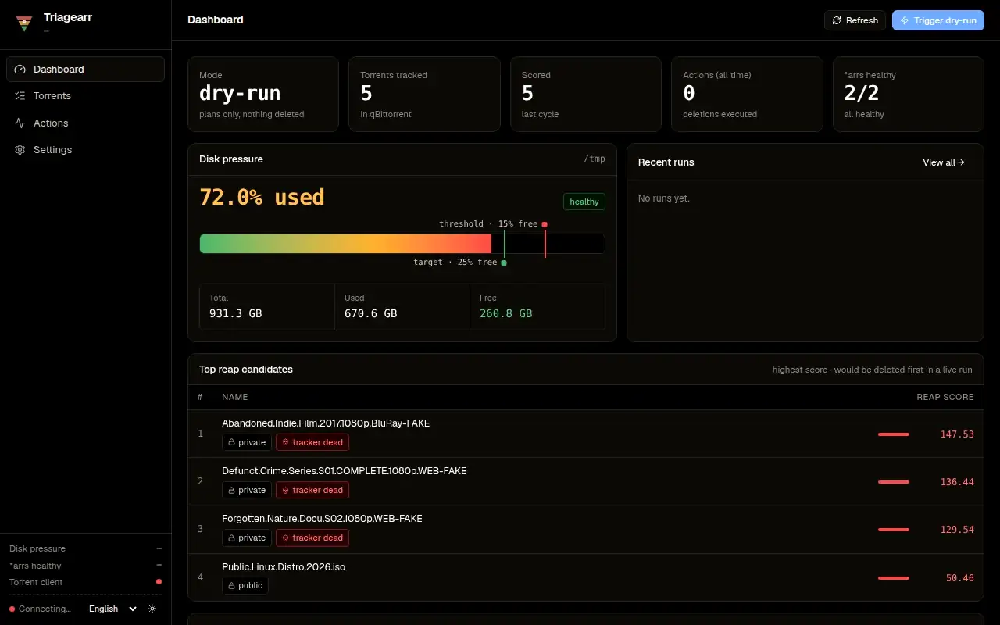

<div align="center">


# Triagearr

**Disk-pressure-aware media reaper for *arr + torrent-client stacks — keeps your Plex/Jellyfin library lean without breaking your seed.**

[](https://go.dev)
[](LICENSE)
[](docs/ROADMAP.md)



</div>

---

## What it does

Triagearr **triages** your media library when disk space gets tight. It scores every torrent by seed value (ratio, upload velocity, swarm size), then asks the relevant *arr app to delete the lowest-value media until the disk is back below pressure — while protecting torrents your tracker still needs (HnR window, min seed time) and rare content the swarm still depends on (low seeders).

It is **not** a download cleaner like [Cleanuparr](https://github.com/Cleanuparr/Cleanuparr). It is **not** a watch-history-based library cleaner like [Maintainerr](https://github.com/Maintainerr/Maintainerr) or [Janitorr](https://github.com/Schaka/janitorr). It sits between them, filling a specific gap:

> **No existing tool triggers media deletion on disk pressure while being aware of torrent-client seed obligations and swarm health.**

That's the niche.

## Who it's for

You run a Plex (or Jellyfin/Emby) homelab with:
- One or more **\*arr media managers** (see the support matrix below)
- A **torrent client** (qBittorrent today)
- **Hardlinks** between your `data/torrents/` and `data/media/` trees, on one shared mount (the standard [TRaSH-guides layout](https://trash-guides.info/File-and-Folder-Structure/) — Triagearr requires it)

You care about:
- Always having free disk space without manual janitoring
- Maintaining or growing your ratio on private trackers
- Not getting flagged for hit-and-run, ever
- Not stripping the swarm of rare content

If that's you, read on.

## Supported integrations

Triagearr plugs into three pluggable roles. Each is opt-in and configured
independently; the interfaces are built to grow more backends — qBittorrent and
Telegram are simply the first in each lane.

| Role | Supported today | Planned / scaffolded |
|---|---|---|
| **\*arr media managers** | Sonarr, Radarr, Whisparr v2/v3 | Lidarr *(interface stub — not functional yet)* |
| **Torrent clients** | qBittorrent | Transmission, Deluge, rTorrent *(UI placeholders, no backend yet)* |
| **Notifications** | Telegram | Webhook, Discord, Pushover, ntfy *(post-1.0)* |

See [`docs/ROADMAP.md`](docs/ROADMAP.md) for sequencing. Adding a backend means
implementing one Go interface (`ArrInstance`/`FileDeleter`, `TorrentClient`, or
`Notifier`) — the rest of the daemon is integration-agnostic.

## Status

⚠️ **Alpha — under active development.** Not production-ready yet. The current roadmap is in [`docs/ROADMAP.md`](docs/ROADMAP.md). Star the repo to follow progress.

## Quick start

```bash
docker run -d \
  --name triagearr \
  --restart unless-stopped \
  --user 1000:1000 \
  -p 9494:9494 \
  -v /opt/triagearr/config:/config \
  -v /mnt/user/data:/data:ro \
  -e TZ=Europe/Paris \
  ghcr.io/triagearr/triagearr:latest
```

> ⚠️ **Mount it like the rest of your stack.** Triagearr requires the [TRaSH-guides shared-mount layout](https://trash-guides.info/File-and-Folder-Structure/How-to-set-up/Docker/): the shared data root mounted at the **same container path** — and the container run as the **same PUID** — as your torrent client and your *arrs. `/data` and `1000:1000` above are placeholders for *your* stack's values. A mismatched layout is detected and **refused at boot** ([ADR-0023](docs/adr/0023-trash-shared-mount-convention.md)).

See [`docs/DEPLOYMENT.md`](docs/DEPLOYMENT.md) for the mount & UID contract, a full Docker Compose example, and integration with an existing *arr stack.

## Dashboard

A React + Tailwind dashboard ships embedded in the binary at `http://127.0.0.1:9494/`:

- Real-time disk pressure gauge for the watched volume.
- Sortable, filterable torrent list with per-torrent score breakdown, tracker status, *arr links, and history charts.
- Action timeline with per-action audit drawer.
- One-click dry-run; live runs gated behind a typed-name confirmation modal.
- Effective configuration view with secrets redacted.

Auth is **opt-in built-in** ([ADR-0019](docs/adr/0019-opt-in-auth.md)): out of the box the UI is open (meant for a loopback bind behind TinyAuth/Authelia/Caddy). Enable a username/password from Settings → Security and every request then needs a session cookie or an `X-API-Key` header (the key is auto-generated to `/config/api_key` on first boot, Sonarr-style). See also [ADR-0018](docs/adr/0018-m6-frontend-stack.md) for the frontend stack.

## Documentation

| Document | What's in it |
|---|---|
| [docs/ARCHITECTURE.md](docs/ARCHITECTURE.md) | Components, data flow, interfaces |
| [docs/STACK.md](docs/STACK.md) | Tech stack and version pins |
| [docs/CONFIGURATION.md](docs/CONFIGURATION.md) | YAML reference, every key explained |
| [docs/SCORING.md](docs/SCORING.md) | How the `DeleteScore` is computed |
| [docs/HARDLINK_TOPOLOGY.md](docs/HARDLINK_TOPOLOGY.md) | Why deletion happens *arr-side, with diagrams |
| [docs/DEPLOYMENT.md](docs/DEPLOYMENT.md) | Docker, env vars, secrets, Traefik labels |
| [docs/VERIFYING.md](docs/VERIFYING.md) | Verify signatures, SBOM & SLSA provenance |
| [docs/ROADMAP.md](docs/ROADMAP.md) | Milestones M0 → v1.0 |
| [docs/adr/](docs/adr/) | Architectural Decision Records |

## Verify a release

Releases are signed with [cosign](https://github.com/sigstore/cosign) keyless
(OIDC) and ship with a CycloneDX SBOM and SLSA build provenance per artifact.
The full verification recipe (checksum, container image, provenance) lives in
[`docs/VERIFYING.md`](docs/VERIFYING.md).

## Design pillars

1. **Safe by default.** Dry-run mode is the default. Every destructive action requires explicit opt-in per *arr instance.
2. **Auditable.** Every decision is persisted with its reasoning. You can replay history and ask "why was this deleted?".
3. **Polite to the swarm.** Rare-content guard is a first-class concept. Triagearr will not strip a torrent the swarm needs.
4. **Tracker-aware.** HnR windows and min seed times are respected per-tracker, configured at runtime from the dashboard (per-tracker policy, ADR-0026).
5. **Pluggable.** Media managers (*arr), torrent clients and notifiers are all opt-in behind Go interfaces — one instance per kind, each independently enabled and configured.
6. **Hardlink-correct.** Deletion happens *arr-side first, then the torrent client cleans up. The order matches the topology and frees space deterministically.

## Acknowledgments

Inspired by — and complementary to:
- [Maintainerr](https://github.com/Maintainerr/Maintainerr) for rule-based library cleanup
- [Cleanuparr](https://github.com/Cleanuparr/Cleanuparr) for download client cleanup
- [Janitorr](https://github.com/Schaka/janitorr) for the disk-pressure idea (Jellyfin/Emby focused)
- [qbit_manage](https://github.com/StuffAnThings/qbit_manage) for orphan handling

Triagearr is what's missing between these projects.

## License

MIT — see [LICENSE](LICENSE).
