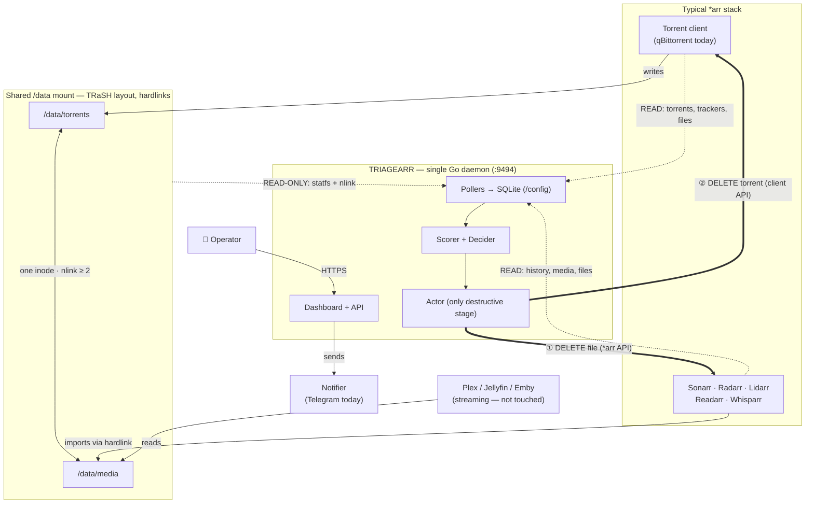
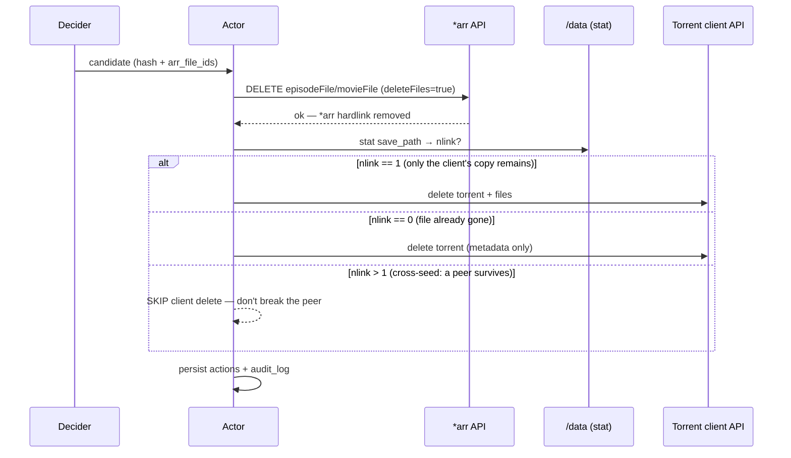

# Architecture

## Overview

Triagearr is a single-binary Go daemon that orchestrates media deletion across a Plex + *arr + torrent-client stack (qBittorrent is the first — and currently only — supported client; the `TorrentClient` interface keeps the rest of the system client-agnostic, see ADR-0025). It is built as a collection of decoupled components communicating through Go interfaces, with SQLite as the source of truth for both relational data (torrents ↔ media ↔ actions) and time-series snapshots (ratio, seeders, velocity over time).

## Where Triagearr fits in the stack

Triagearr does not replace any part of a normal *arr setup — it plugs in alongside it, **observes everything read-only**, and is the **only** component allowed to delete. It writes to its own `/config` (SQLite) but never to the shared media mount; every destructive operation goes through the *arr and torrent-client APIs, never the filesystem.



### The critical interaction: ordered deletion (ADR-0003)

Because the torrent copy and the *arr library copy are the **same inode** (hardlink), the order of deletion is what makes space reclaim deterministic and seed-safe. The Actor always deletes the *arr-side file first, then re-checks `nlink` before touching the torrent client.



The internal component breakdown below zooms *inside* the Triagearr box.

## High-level diagram

```
┌──────────────────────────────────────────────────────────────────┐
│                          TRIAGEARR                                │
│                                                                   │
│   ┌──────────┐  ┌──────────┐  ┌──────────┐  ┌──────────┐         │
│   │  Qbit    │  │  *arr    │  │ Maintainerr│ │  Disk    │         │
│   │  Poller  │  │  Pollers │  │  Poller   │ │  Poller  │         │
│   │          │  │ (Sonarr, │  │ (optional,│ │          │         │
│   │          │  │  Radarr, │  │  read-only│ │          │         │
│   │          │  │  Lidarr, │  │  in V2)   │ │          │         │
│   │          │  │  Readarr,│  │           │ │          │         │
│   │          │  │ Whisparr)│  │           │ │          │         │
│   └────┬─────┘  └────┬─────┘  └────┬─────┘ └────┬─────┘         │
│        │             │              │             │              │
│        ▼             ▼              ▼             ▼              │
│   ┌──────────────────────────────────────────────────────────┐  │
│   │              Snapshot Store (SQLite, modernc)            │  │
│   │ snapshots_raw · snapshots_daily · torrents · media       │  │
│   │ actions · audit_log · arr_instances · disk_pressure      │  │
│   └─────────────────────────┬────────────────────────────────┘  │
│                             │                                    │
│                ┌────────────▼─────────────┐                      │
│                │         Linker           │                      │
│                │   torrent ↔ arr file     │   via *arr history  │
│                │   (ADR-0012, API-only)   │                      │
│                └────────────┬─────────────┘                      │
│                             │                                    │
│                ┌────────────▼─────────────┐  ┌───────────────┐  │
│                │         Scorer           │◄─┤  Config (YAML)│  │
│                │  DeleteScore = f(...)    │  │  per-tracker  │  │
│                │  + exclusions + guards   │  │  + weights    │  │
│                └────────────┬─────────────┘  └───────────────┘  │
│                             │                                    │
│                ┌────────────▼─────────────┐                      │
│                │        Decider           │                      │
│                │  Triggered by:           │                      │
│                │   - schedule (cron)      │                      │
│                │   - disk pressure        │                      │
│                │   - manual API call      │                      │
│                │  Selects top-K candidates│                      │
│                └────────────┬─────────────┘                      │
│                             │                                    │
│                ┌────────────▼─────────────┐  ┌───────────────┐  │
│                │         Actor            │─►│  *arr API     │  │
│                │  1. delete via *arr      │  │ (Sonarr,      │  │
│                │  2. check nlink on /tor  │  │  Radarr, …)   │  │
│                │  3. delete via qbit      │  └───────────────┘  │
│                │  4. persist audit log    │  ┌───────────────┐  │
│                │                          │─►│  qBittorrent  │  │
│                └────────────┬─────────────┘  │     API       │  │
│                             │                 └───────────────┘  │
│                ┌────────────▼─────────────┐  ┌───────────────┐  │
│                │       Notifier           │─►│  Telegram     │  │
│                │  per-action templates    │  │  webhook…     │  │
│                └──────────────────────────┘  └───────────────┘  │
│                                                                  │
│   ┌──────────────────────────────────────────────────────────┐  │
│   │   HTTP Server (net/http ServeMux) — read + control plane │  │
│   │   /api/v1/...  +  embedded React UI (shadcn/ui)          │  │
│   └──────────────────────────────────────────────────────────┘  │
└──────────────────────────────────────────────────────────────────┘
```

## Data flow

### 1. Observation (always on)

Every poller runs on its own configurable interval. Each tick produces structured records appended to SQLite:

- **qBit poller** → `snapshots_raw` (one row per active torrent: ratio, uploaded, seeders, leechers, state, last_activity)
- **\*arr pollers** → `media` upsert (id, title, file paths, size, tags)
- **Disk poller** → `disk_pressure` (the watched volume: total, used, free, percent)
- **Maintainerr poller (V2, optional)** → `maintainerr_collections` snapshot (read-only mirror of what Maintainerr plans to delete)

The pollers never block each other and never trigger actions. They are purely observational.

### 2. Downsampling (daily)

A background job once per day:
- Aggregates `snapshots_raw` from D-2 into `snapshots_daily` (avg/min/max per torrent per day)
- Deletes `snapshots_raw` older than `retention.snapshots_raw` (default 7d / `168h`)
- Keeps `snapshots_daily` for `retention.snapshots_daily` (default 1y / `8760h`)
- Runs `VACUUM` if space reclaim threshold crossed

This keeps the DB lean indefinitely (~50 MB steady state for a 500-torrent library).

### 3. Linking (API-only, ADR-0012)

The linker resolves the relationship between a qBittorrent torrent (by hash) and the *arr file(s) it produced — strictly via the *arr `history` endpoint, no filesystem stat. For each *arr instance the linker queries `GET /api/v3/history?eventType=downloadFolderImported` filtered by `downloadId == torrentHash`, then persists `(arr_type, file_id, download_id, imported_path, dropped_path)` rows in `arr_imports`.

Under the TRaSH-guides convention (ADR-0023) qBit and the *arrs see the same paths Triagearr sees — `imported_path` is directly usable.

The linker is event-driven: each *arr poll refreshes `arr_imports`; rows are kept until the source torrent is pruned (cascade).

### 4. Scoring (event-driven, cached)

The scorer reads from `snapshots_raw + snapshots_daily + media + arr_instances` and computes a `DeleteScore` per torrent. See [SCORING.md](SCORING.md) for the full formula. Output is persisted to the `scores` table with the contributing factors (auditability).

Scoring is **event-driven** (ADR-0020): a feeding poller (qbit, tracker, *arr) signals the scorer after every successful tick, and the scorer re-scores the whole library after a short debounce window. There is no fixed scoring interval — the pollers' own cadences pace the scorer, which means a fresh start scores as soon as the first poll lands instead of racing an empty store.

### 5. Decision (triggered)

The decider runs when any trigger fires:

- **Cron**: scheduled run (default daily, e.g. `0 4 * * *`)
- **Disk pressure**: when the watched volume's `free_percent < threshold`, the decider fires immediately
- **Manual**: `POST /api/v1/runs` from the UI or CLI

The decider:
1. Loads the current scores
2. Excludes torrents in HnR window, in `keep` lists, low-seeder protected, etc.
3. Sorts by score descending
4. Selects top-K until target free space is reached (or `max_deletions_per_run` cap)
5. Hands the candidate list to the Actor

### 6. Action (the only destructive step)

For each candidate, the Actor performs an atomic sequence:

```
a. lookup arr_media_id → call *arr API: DELETE /api/v3/movie/{id}?deleteFiles=true
   (or equivalent for series/episode/album/...)
b. wait for *arr to confirm the file is gone
c. stat the torrent's save path → check current nlink (paths coincide per ADR-0023)
d. if nlink == 1 (only the torrent copy remains) → qbit delete with deleteFiles=true
   if nlink == 0 (file already gone, *arr removed both refs) → qbit delete metadata only
   if nlink > 1 (cross-seed: another torrent shares the inode) → qbit delete without files,
        log a warning; the other torrent keeps seeding
e. persist actions + audit_log atomically in SQLite
f. for disk-pressure runs only, a post-action notification is dispatched (ADR-0021)
```

**Pre-flight safety check** before any of the above:
- Mode is `live` (else dry-run logs and exits)
- Per-instance `act: true` for the relevant *arr
- Rate limit not hit
- Re-validates the torrent state is still consistent with the score (defense against race conditions)

If `mode: dry-run`, steps (a)–(d) are skipped; only (e) records a "would-have-done" entry.

### 7. Audit & observability

Every action emits:
- A `actions` row (structured: who, when, what, why, score breakdown, reversibility info)
- An `audit_log` row (free-form with full context dump)
- A notification — disk-pressure runs only, if configured (ADR-0021)
- A `triagearr_actions_total{result="...",arr="..."}` Prometheus counter increment (V2)

The dashboard renders these as a timeline.

## Key interfaces

All cross-component coupling goes through Go interfaces defined in `internal/triagearr/types.go`. Reading is mandatory; the destructive and per-file capabilities are **optional** interfaces a client type-asserts into — stubs (lidarr/readarr/whisparr) satisfy only the read contract:

```go
// ArrInstance is the read contract every *arr client implements.
// Exactly one instance per kind (sonarr, radarr, …) — the kind is the identity.
type ArrInstance interface {
    Name() string
    Type() ArrType        // sonarr | radarr | lidarr | readarr | whisparr_v2 | whisparr_v3
    Poll() bool           // is read-allowed
    Act()  bool           // is delete-allowed
    ListMedia(ctx context.Context) ([]MediaItem, error)
    HealthCheck(ctx context.Context) error
}

// FileDeleter is the OPTIONAL delete capability. The M5 Actor consumes this,
// not ArrInstance — deletion is per library file (episodeFile/movieFile id),
// never per media item. Stub clients omit it.
type FileDeleter interface {
    DeleteMediaFile(ctx context.Context, fileID int64, opts DeleteOpts) error
}

// FileLister / ImportLister are the OPTIONAL read capabilities the arr poller
// type-asserts on to fan out per-file metadata (FileLister) and refresh the
// arr_imports link table from *arr history (ImportLister, ADR-0012).

// TorrentClient abstracts the download client (qBittorrent today; one instance
// per deployment). Was named QbitClient pre-ADR-0025.
type TorrentClient interface {
    ListTorrents(ctx context.Context) ([]Torrent, error)
    TorrentFiles(ctx context.Context, h Hash) ([]TorrentFile, error)
    ListTrackers(ctx context.Context, h Hash) ([]TrackerInfo, error)
    Delete(ctx context.Context, h Hash, opts DeleteOpts) error
}

// Notifier delivers one post-action Report to a single provider.
// Defined in internal/notify (not types.go); see ADR-0021.
type Notifier interface {
    Send(ctx context.Context, r notify.Report) error
    Name() string
}
```

The scorer is not a single-method interface: `internal/scorer` reads the store directly and persists per-torrent `scores` + `score_factors` rows; per-tracker policy and the rare-content default come from the `tracker_policies` / `scoring_defaults` tables (ADR-0026), not from a `ScoringConfig` value.

Concrete implementations live under `internal/clients/arr/{sonarr,radarr,lidarr,readarr,whisparr_v2,whisparr_v3,stub}/`, `internal/clients/torrent/qbit/`, `internal/scorer/`, and `internal/notify/telegram/`. The two registries (`internal/clients/arr/registry`, `internal/clients/torrent/torrentregistry`) build the live client set from the DB-owned connection rows (ADR-0022, ADR-0025).

## Storage schema

The authoritative schema is the single embedded migration [`internal/store/migrations/0001_init.sql`](../internal/store/migrations/0001_init.sql) (the project is alpha — migrations are squashed into one baseline rather than kept additive, per the no-back-compat stance). Summary of the live tables:

| Table | Purpose | Estimated row count (500 torrents, 1y) |
|---|---|---|
| `torrents` | Current state of each qBit torrent (last seen); carries the sticky `protected` flag | ~500 |
| `torrent_files` | Per-file state incl. sampled `nlink` (cross-seed pre-filter) | ~thousands |
| `torrent_trackers` | Per-tracker status + `first_seen_dead` (ADR-0009/0013) | ~thousands |
| `snapshots_raw` | High-resolution qBit snapshots, raw-retention window | ~720k (after rotation) |
| `snapshots_daily` | Downsampled daily aggregates, 1y retention | ~180k |
| `media` / `media_files` | *arr media items + their on-disk files | ~thousands |
| `arr_imports` | torrent ↔ *arr file link, from import history (ADR-0012) | ~thousands |
| `arr_instances` | Observed *arr instances, last health check | up to 6 (one per kind) |
| `arr_connections` / `torrent_client_connections` | DB-owned connection config (source of truth, ADR-0022/0025) | ≤6 / ≤4 |
| `disk_pressure` | Disk usage snapshots for the watched volume | ~10k |
| `scoring_defaults` / `tracker_policies` | DB-owned scoring policy (ADR-0026), UI-edited | 1 / small |
| `scores` / `score_factors` | Latest computed score per torrent + per-factor breakdown | ~500 / ~3.5k |
| `runs` / `run_items` | Decider invocations + their ordered candidate plans | grows slowly |
| `actions` / `audit_log` | Every action taken (or would-have-been) + per-file audit trail | grows slowly |
| `auth_users` / `auth_sessions` | Opt-in built-in auth (ADR-0019) | tiny |
| `settings_overrides` | UI-managed config overrides (notifications, etc.) | small |

`maintainerr_collections` is a V2 table and is **not** in the current schema. Tables use composite indexes for the time-range queries the dashboard issues.

## Process model

Single binary, single process, multiple goroutines:

- 1 goroutine per poller (configurable interval)
- 1 goroutine for the scorer loop (event-driven: re-scores on poller signals, debounced)
- 1 goroutine for the downsampler (daily tick)
- 1 goroutine for the decider (subscribes to triggers via channels)
- 1 goroutine for the actor (consumes decisions via channel, processes serially to respect rate limits)
- N goroutines for the HTTP server (chi handlers)

A central `context.Context` is propagated everywhere; `SIGTERM` triggers graceful shutdown that lets the actor finish its current decision before exiting.

## HTTP API

Served on `127.0.0.1:9494` by default, routed by the stdlib `net/http.ServeMux` (Go 1.22 method-aware patterns + `{hash}` wildcards), middleware applied by handler-wrapping: `s.security(s.auth(s.runRateLimit(h)))`.

**Authentication (ADR-0019)** is opt-in built-in auth, not the old loopback/auth-mode model (removed in M6.1):

- When no user is registered in `auth_users`, the `auth` middleware is a pass-through — the API is open (intended for a loopback bind behind TinyAuth/Authelia/Caddy).
- Once a user enables auth, every `auth`-gated handler requires **either** a session cookie (opaque, HttpOnly, SameSite=Lax, 7-day sliding TTL) **or** an `X-API-Key` header (constant-time-compared against the auto-generated key file). Programmatic clients keep using the header.
- `POST /api/v1/runs` is rate-limited 1/min/IP; auth-mutating endpoints 5/min/IP (both via `golang.org/x/time/rate`).

Endpoint surface (current):

```
GET    /healthz                                   unauthenticated liveness probe

# session + auth management (ADR-0019)
GET    /api/v1/session                            current session status
POST   /api/v1/session                            login            (5/min/IP)
DELETE /api/v1/session                            logout
POST   /api/v1/auth/enable                         enable built-in auth (5/min/IP)
POST   /api/v1/auth/disable                        disable           (5/min/IP)
POST   /api/v1/auth/password                       change password   (5/min/IP)

# observation
GET    /api/v1/summary                            dashboard aggregate
GET    /api/v1/version                            build metadata
GET    /api/v1/config                             effective config, secrets redacted
GET    /api/v1/volume                             configured volume + latest disk_pressure
GET    /api/v1/volume/history    ?since=24h        pressure time series
GET    /api/v1/arrs                               instance health
GET    /api/v1/torrents          ?sort=&q=&category=&private=&limit=&offset=
GET    /api/v1/torrents/categories                distinct categories
GET    /api/v1/torrents/{hash}                    detail (trackers, links, score)
GET    /api/v1/torrents/{hash}/snapshots ?since=720h
PUT    /api/v1/torrents/{hash}/protected          sticky per-torrent protect toggle
GET    /api/v1/scores            ?limit=&include_excluded=

# runs / actions
GET    /api/v1/runs/preview                       dry candidate preview (no run row)
POST   /api/v1/runs                               body: {mode:"live"|…}; 1/min/IP
GET    /api/v1/runs              ?limit=
GET    /api/v1/runs/{id}                          one run + items
GET    /api/v1/runs/{id}/actions                  actions for one run
GET    /api/v1/actions           ?limit=&offset=   global timeline
GET    /api/v1/actions/{id}                       one action + audit trail

# UI-managed config (ADR-0022, 0025, 0026)
GET    /api/v1/settings                           override map
PUT    /api/v1/settings
DELETE /api/v1/settings/{key}
GET|PUT  /api/v1/scoring/defaults                 scoring_defaults singleton
POST   /api/v1/scoring/simulate                   replay scorer over archetype fixtures
GET    /api/v1/scoring/tracker-policies
PUT|DELETE /api/v1/scoring/tracker-policies/{host}
GET    /api/v1/arr-connections
PUT|DELETE /api/v1/arr-connections/{kind}
GET    /api/v1/torrent-client-connections
PUT|DELETE /api/v1/torrent-client-connections/{kind}
```

Every response carries the security header set (`Content-Security-Policy`, `X-Content-Type-Options: nosniff`, `Referrer-Policy: no-referrer`, `Permissions-Policy: ()`).

The React UI is served from the same binary via `embed.FS` (`web/web.go`): asset paths serve directly from `web/dist/`, everything else falls back to `index.html` so the in-memory SPA router keeps working on full-page reloads. The Vite build outputs to `web/dist/`; `make build` runs `bun run build` inside `web/` before invoking `go build`.

## What lives outside the binary

- Configuration file (mounted from disk, hot-reloaded on `SIGHUP`)
- SQLite database file
- Optional Prometheus scrape endpoint (`/metrics`, V2)

That's it. No external state, no message queue, no Redis. Triagearr is intentionally a self-contained workhorse.

## Deployment topology

In the reference homelab (QNAP + Container Station), Triagearr lives in the `cleanup` stack next to `qbit_manage` and (optionally) `maintainerr`. See [DEPLOYMENT.md](DEPLOYMENT.md) for the docker-compose snippet.

## Non-goals

Things Triagearr will not do, on purpose:

- **Download client management** (tags, categories, pausing) — that's `qbit_manage`'s job
- **Malware / stalled / blocked download removal** — that's `Cleanuparr`'s job
- **Rule-based library cleanup driven by watch history** — that's `Maintainerr`'s job
- **Orphan detection unrelated to Triagearr's own actions** — `qbit_manage` handles this
- **Distributed multi-node operation** — single homelab, single instance

By staying focused, Triagearr cohabits cleanly with the rest of the ecosystem instead of competing with it.
